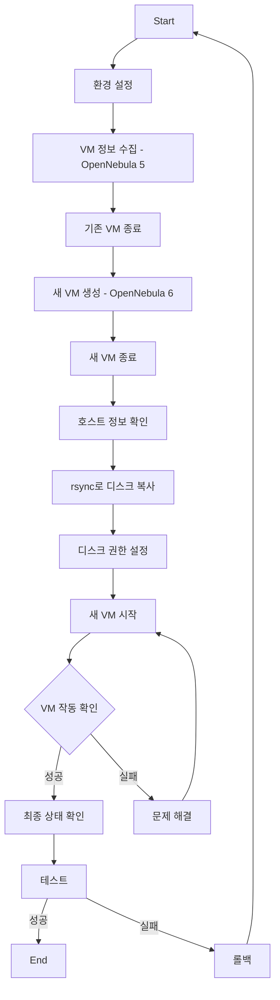

```mermaid
graph TD
    A[Start] --> B[환경 설정]
    B --> C[VM 정보 수집 - OpenNebula 5]
    C --> D[기존 VM 종료]
    D --> E[새 VM 생성 - OpenNebula 6]
    E --> F[새 VM 종료]
    F --> G[호스트 정보 확인]
    G --> H[rsync로 디스크 복사]
    H --> I[디스크 권한 설정]
    I --> J[새 VM 시작]
    J --> K{VM 작동 확인}
    K -->|성공| L[최종 상태 확인]
    K -->|실패| M[문제 해결]
    M --> J
    L --> N[테스트]
    N -->|성공| O[End]
    N -->|실패| P[롤백]
    P --> A
```